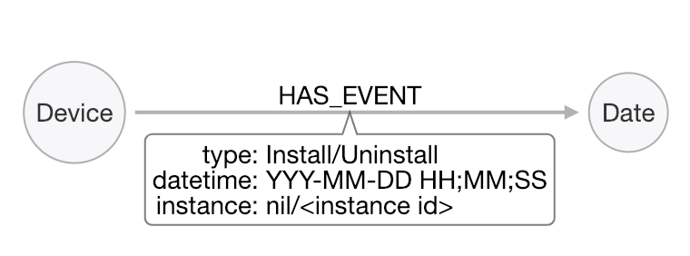
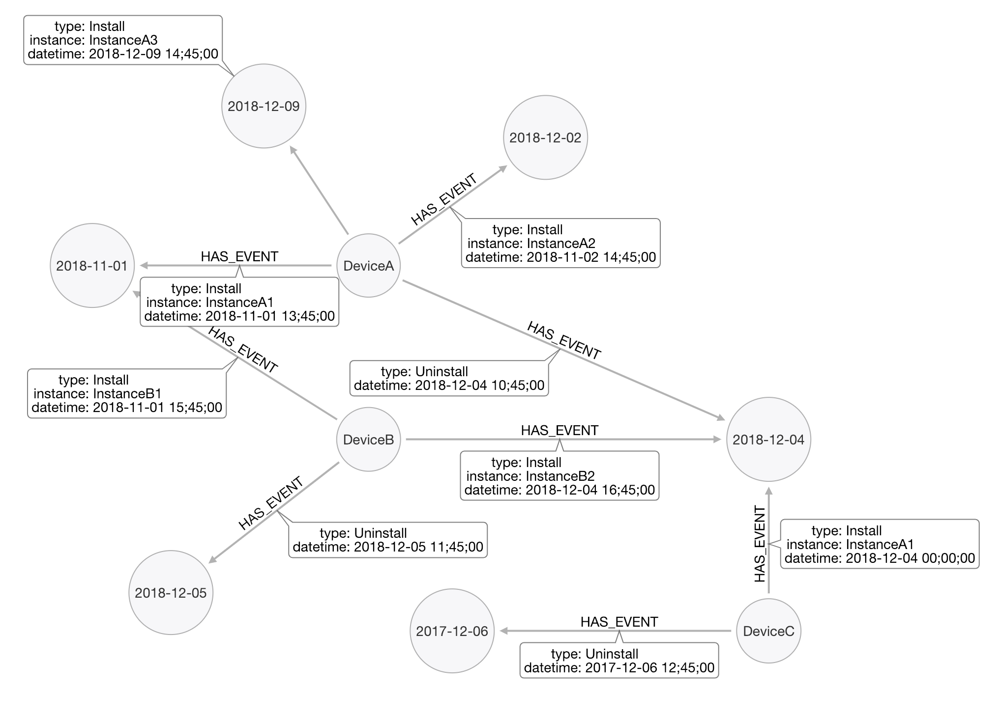
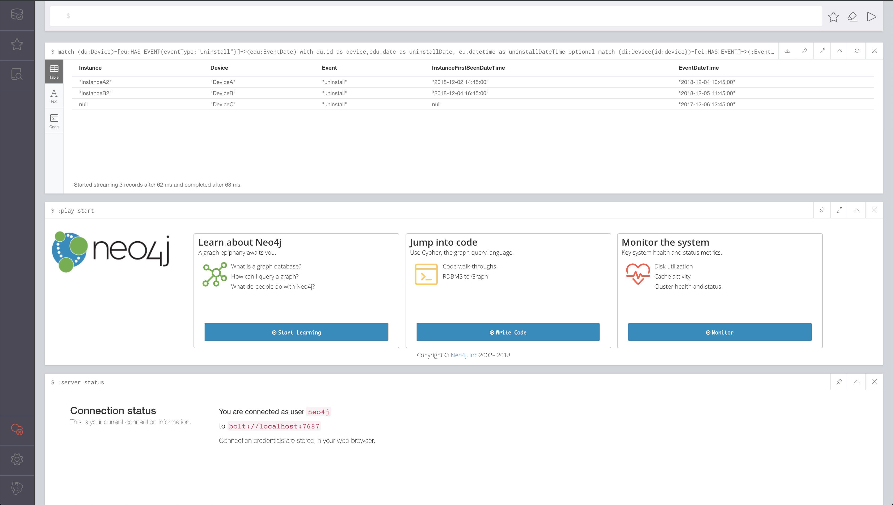

# Data Engineer Assignment

The Chama App uses the Firebase SDK to report events. In the firebase event information it's possible to find DeviceId's and InstanceId's. 
 - **DeviceId** is a unique Id that identifies the physical device, the phone or tablet where the application is installed.
 - **InstanceId** is a Id given every time that the device installs the application. Meaning, if the same device installs the App several times, it gain new instanceId's but the deviceId will remain the same.

Most App related events have DeviceId and InstanceId information, but due to technical reasons, the uninstall event, only has deviceId information. 

*t1: Uninstall event information*

|DeviceId|EventName|EventDateTime       |
|--------|---------|--------------------|
|DeviceA |uninstall|Dec 4, 2018 10:45:00|
|DeviceB |uninstall|Dec 5, 2018 11:45:00|
|DeviceC |uninstall|Dec 6, 2017 12:45:00|

*t2: Instance information*

|Instance  |DeviceId|InstanceFirstSeenDateTime|
|----------|--------|-------------------------|
|InstanceA1|DeviceA |Nov 1, 2018 13:45:00     |
|InstanceA2|DeviceA |Dec 2, 2018 14:45:00     |
|InstanceA3|DeviceA |Dec 9, 2018 14:45:00     |
|InstanceB1|DeviceB |Nov 1, 2018 15:45:00     |
|InstanceB2|DeviceB |Dec 4, 2018 16:45:00     |
|InstanceCX|DeviceC |Dec 4, 2018 00:00:00     |

For Chama, it's important to determine for how long the App was installed.

***tf**: Uninstalls final table:*

|Instance  |DeviceId|EventName|InstanceFirstSeenDateTime|EventDateTime       |
|----------|--------|---------|-------------------------|--------------------|
|InstanceA2|DeviceA |uninstall|2018-12-02 14:45:00      |2018-12-04 10:45:00 |
|InstanceB2|DeviceB |uninstall|2018-12-04 16:45:00      |2018-12-05 11:45:00 |

## Solution

Here a graph database is used to represent the information from tables t1, t2 and tf. A clean instance of neo4j 3.5 was used.

### Data Model

A model with 2 labels, Device and Date, is proposed as a good alternative to represent the information within csv files:



The resulting data model is the follow:


### Why Graphs?
Making use of graph capabilities, it is possible to reduce the number of 'tables', and the data that we need to store.

Further, grouping (linking) devices top Dates (YYYY-MM-DD) trough a event relationship, it will make possible to identify events by date easily, also, being possible to extend functionalities as:
- get uninstall events from 2018-12-04 where Device has installed X intances before 2018-11-04. This is a very simple task for a graph db, as the complexity for traversing nodes is O(1). 


## Running the assessment
Here you can find a Makefile that has 5 methods. You should execute them in the following order:

1 - `make start-db`
    At 1st time, it will download a docker image from docker hub, and start a clean neo4j instance acessible at http://localhost:7474 (user: neo4j / pass:password). This task could take a few minutes (or seconds after having the image). You can check that db is empty acessing the brouser and executing the following query:
    
    `
    MATCH (n) RETURN COUNT(n)
    ` 

    you will see that 0 nodes where found.

2 - `make load-instances`
3 - `make load-events`
    The previous 2 steps will load the data into neo4j. Again, you can use the same query on step 1 to count the actual number of nodes.

4 - `make get-uninstalls`
    It will return the following result:
    
    `
    {
    "columns" : [ "Instance", "Device", "Event", "InstanceFirstSeenDateTime", "EventDateTime" ],
    "data" : [ [ "InstanceA2", "DeviceA", "uninstall", "2018-12-02 14:45:00", "2018-12-04 10:45:00" ], [ "InstanceB2", "DeviceB", "uninstall", "2018-12-04 16:45:00", "2018-12-05 11:45:00" ], [ null, "DeviceC", "uninstall", null, "2017-12-06 12:45:00" ] ]
    }
    `


5 - `make kill-db`
    Stop docker container. No data will be persisted.

## Non Unix User? No Problem
If using a non unix os, you can run the solution by 2 ways:

1 - download the docker image from docker hub:
`docker run -p 7474:7474 -p 7687:7687 coppetti/db-app`

2 - build the image locally using the Dockerfile under docker/ folder.
`docker build -t <name> .`
`docker run -p 7474:7474 -p 7687:7687 <name>`

### Running queries
After starting the docker container, you can run queries via neo4j web interface: http://localhost:7474 (user: neo4j / pass: password)



+ Load Instances:
```
with {Jan:"01",Feb:"02",Mar:"03",Apr:"04",May:"05",Jun:"06",Jul:"07",Aug:"08",Sep:"09",Oct:"10",Nov:"11",Dec:"12"} as months,
{_1:"01",_2:"02",_3:"03",_4:"04",_5:"05",_6:"06",_7:"07",_8:"08",_9:"09",_10:"10",_11:"11",_12:"12",_13:"13",_14:"14",_15:"15",_16:"16",_17:"17",_18:"18",_19:"19",_20:"20",_21:"21",_22:"22",_23:"23",_24:"24",_25:"25",_26:"26",_27:"27",_28:"28",_29:"29",_30:"30",_31:"31"} as days

load csv with headers from "https://raw.githubusercontent.com/chamatheapp/chama-data-engineer-assignment/master/Instances.csv" as row
with row,days,months, split(row.InstanceFirstSeenDateTime,' ') as date
merge (device:Device{id:row.DeviceId})
merge (datetime:EventDate{date:date[2]+'-'+months[date[0]]+'-'+days['_'+replace(date[1],',','')]})
merge (device)-[:HAS_EVENT{instance:row.Instance,eventType:"Install",datetime:date[2]+'-'+months[date[0]]+'-'+days['_'+replace(date[1],',','')]+' '+date[3]}]->(datetime)
```

+ Load Events:
```
with {Jan:"01",Feb:"02",Mar:"03",Apr:"04",May:"05",Jun:"06",Jul:"07",Aug:"08",Sep:"09",Oct:"10",Nov:"11",Dec:"12"} as months,
{_1:"01",_2:"02",_3:"03",_4:"04",_5:"05",_6:"06",_7:"07",_8:"08",_9:"09",_10:"10",_11:"11",_12:"12",_13:"13",_14:"14",_15:"15",_16:"16",_17:"17",_18:"18",_19:"19",_20:"20",_21:"21",_22:"22",_23:"23",_24:"24",_25:"25",_26:"26",_27:"27",_28:"28",_29:"29",_30:"30",_31:"31"} as days

load csv with headers from "https://raw.githubusercontent.com/chamatheapp/chama-data-engineer-assignment/master/UninstallEvents.csv" as row
with row,days,months, split(row.EventDateTime,' ') as date
merge (device:Device{id:row.DeviceId})
merge (datetime:EventDate{date:date[2]+'-'+months[date[0]]+'-'+days['_'+replace(date[1],',','')]})
merge (device)-[:HAS_EVENT{eventType:"Uninstall",datetime:date[2]+'-'+months[date[0]]+'-'+days['_'+replace(date[1],',','')]+' '+date[3]}]->(datetime)
```

+ Get Uninstall Events:
```
match (du:Device)-[eu:HAS_EVENT{eventType:"Uninstall"}]->(edu:EventDate)
with du.id as device,edu.date as uninstallDate, eu.datetime as uninstallDateTime
optional match (di:Device{id:device})-[ei:HAS_EVENT]->(:EventDate) 
where uninstallDateTime > ei.datetime 
with device,uninstallDateTime,collect(ei) as instance
return instance[0].instance as Instance, device as Device,"uninstall" as Event, instance[0].datetime as InstanceFirstSeenDateTime, uninstallDateTime as EventDateTime
```

+ Mistakes Happem:
In the case of any mistake, you can reset (remove all nodes and relatiuonships) the db with: `MATCH (n) DETACH DELETE n`


## Still have issues?
Do not mind to contact: matheuscoppetti@gmail.com 