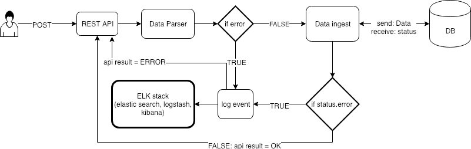

# Data Engineer Assignment
Assignment for data engineer position

## Introduction
Chama is relatively new, modern company, with an [IOS App](https://itunes.apple.com/BR/app/id1228143385?mt=8) and [Android App](https://play.google.com/store/apps/details?id=br.project.pine). 
To grow our company it's imperative that we make a special effort in collecting all information available around the App and make it available for everyone in the company.
Some information about App usage is generated by the our own App and our own backend API. Other sources of information, like the Google Play Store, can provide very useful insights on App performance and user rating.
Chama is very data-oriented and, most decisions are made based on appropriate metrics, therefore, data quality is a must and a concern of everyone involved.

-----

### Exercise 1: Device Uninstalls
The Chama App uses the Firebase SDK to report events. In the firebase event information it's possible to find DeviceId's and InstanceId's. 
 - **DeviceId** is a unique Id that identifies the physical device, the phone or tablet where the application is installed.
 - **InstanceId** is a Id given every time that the device installs the application. Meaning, if the same device installs the App several times, it gain new instanceId's but the deviceId will remain the same.

Most App related events have DeviceId and InstanceId information, but due to technical reasons, the uninstall event, only has deviceId information. 

*t1: Uninstall event information*

|DeviceId|EventName|EventDateTime       |
|--------|---------|--------------------|
|DeviceA |uninstall|Dec 4, 2018 10:45:00|
|DeviceB |uninstall|Dec 5, 2018 11:45:00|
|DeviceC |uninstall|Dec 6, 2017 12:45:00|

*t2: Instance information*

|Instance  |DeviceId|InstanceFirstSeenDateTime|
|----------|--------|-------------------------|
|InstanceA1|DeviceA |Nov 1, 2018 13:45:00     |
|InstanceA2|DeviceA |Dec 2, 2018 14:45:00     |
|InstanceA3|DeviceA |Dec 9, 2018 14:45:00     |
|InstanceB1|DeviceB |Nov 1, 2018 15:45:00     |
|InstanceB2|DeviceB |Dec 4, 2018 16:45:00     |
|InstanceCX|DeviceC |Dec 4, 2018 00:00:00     |

For Chama, it's important to determine for how long the App was installed.

***tf**: Uninstalls final table:*

|Instance  |DeviceId|EventName|InstanceFirstSeenDateTime|EventDateTime       |
|----------|--------|---------|-------------------------|--------------------|
|InstanceA2|DeviceA |uninstall|2018-12-02 14:45:00      |2018-12-04 10:45:00 |
|InstanceB2|DeviceB |uninstall|2018-12-04 16:45:00      |2018-12-05 11:45:00 |

(DeviceC is up to you to include it or not)

#### Exercise 1.1: Theory
The goal here is to create a enriched, clean and integrity checked Uninstalls table (**tf**), in some database so that other people can query this information. **Please answer the following questions in short paragraphs**:

 - Assuming that the raw information is available in CSV files, the size of those files define the shape of your solution. Please explain why and mention the different options that you would contemplate.
The size of the files to be imported will have time and resources impact. To achieve better results, I would recommend to split teh data in chunks. FOr each chunk, do a Bulk Load until all data being stored.

Also, the data schema will also have impact in the performance, so we need to be careful when chosing the best schema, and avoid schemas that will result in multiple joins for accessing the information. If the business rules require many joins, maybe a relational DB is not the best choice, for cases with multiple joins, a Graph DB or a Column Based DB will perform better. If the requirements not demand for multiple joins, but for speed when accessing data from particular tables, relational dbs will be the best solution. For scenarios where we need to have a fast write, but the read time is not critical, storing the data in the filesystem (i.e HDFS) will probvide better results.

 - As you noticed, the date format in the tables is not the best to be parsed into a datetime column, how can you surpass this issue?

    The `data` attribute should be parsed at the time of the data ingestion (using DB built-in methods or creating a script (in any programming language) that would parse `date` to a `datetime`. 

    Other solution would be importing `data` as it is, and have a cron job that executes a script/query for parsing `date` attributes at non peak hours. This is not the best solution when we require the (correct)data real time, but is usefull to save resources.

 - The DeviceC has an uninstall date prior to what we see in [InstanceFirstSeenDateTime].
   - What could be the cause of such situation?
    For this scenario I could list some different causes:

        1 - Instance on C was installed before any integration with the Firebase SDK (instanc C being used since 2017, while other are 2018);
    
        2 - When importing the data, a parsing error occurred;
    
        3 - At the time of the first install on device C (<Dec 6, 2017), the data schema was different for t2 was different, after updating the schema some information was lost;
    
        4 - A business rule for t2 was defined later (>Dec 6, 2017), so that, information about some installed instances could be missing.
   
   - Would you include DeviceC in the final Uninstalls table? Why?
        It depends on business rules so:
        
        1 - If for tf, the value extrcted fro this table refers to `which instances were uninstalled and when?`, then no, I would not include DebviceC on it, as it does not aggregate any value.
        
        2 - If for tf, the valuable information is `which device had an uninstall and when`, then yes, DeviceC should be included.

 - When you read the words "enriched", "clean" and "integrity" in the premise of exercise 1.1, what was your understanding of them?
    
    A clean data is that where corrupted/inaccurate fields were corrected/removed by a Data Cleaning Proccess. Enriched data is very similar to a clean data, but it not only refers to a error free data, but also a enhanced and refined data that aggregates more value. Data Integrity will assure that the data is accurate, consistent and non corrupted.

 - Should a data engineer be responsible for data integrity, cleanliness and enrichment? Why?
    
    Yes. A data engineer is responsible not only for the data flow, but also for its integrity. As a data engineer, one should be responsible for the data cleaning, data enrichment in order to achieve a cosnsistent data. 

#### Exercise 1.2: Practice

Using a database of your choice, create the table **tf** when your starting points are the files [Instances.csv](Instances.csv) and [UninstallEvents.csv](UninstallEvents.csv).
In your solution, please **assume that the files are larger than 1GB each**. Any code that you need to write, preferably use c#.

-----

### Exercise 2: External integration
An external provider wants to send us information about popular opinion about Chama as a company and the App. They offer two options to send the information. 
One option is to POST the information, in a URL endpoint that we own, every time that something happens, near real time.
The second option is for us to download information in bulk, CSV format, once a day. 
This information needs to arrive in our data warehouse. Please consider that you might make mistakes in your parsing functionality, you need to be able to re-process past data.
**Please answer the following in short paragraphs**:
 - What option would you choose?

    I would chose a POST request, so that the DB would have the most up to date data. In order to be able to recover from parsing fails, all failures should be logged and reported to a dashboard or a loggin system (logstash + ElasticSearch), then data engineers would be able to identify which records were not loaded, to find the cause and  load them again.
 - What are the advantages of each scenario?

    Using the POST approach, data would be updated on near-real time. Analysts would have access to the most up to date information. This approach could lead to some records not being loaded due parsing errors, and it could take some time until a data engineer reload them.

    A CSV import would achieve better results regarding data integrity, as we can use different tools for data cleaning/enrichment beforehand, and get a feedback of any error when importing the file. Also, this approach is the ideal when we deal with scarse resources, so we could load the data on non peak hours.

Using [draw.io](https://www.draw.io/) or similar, please design a detailed flow that describes the option that you preferred. Please mention the technologies that you would choose for the different steps.

